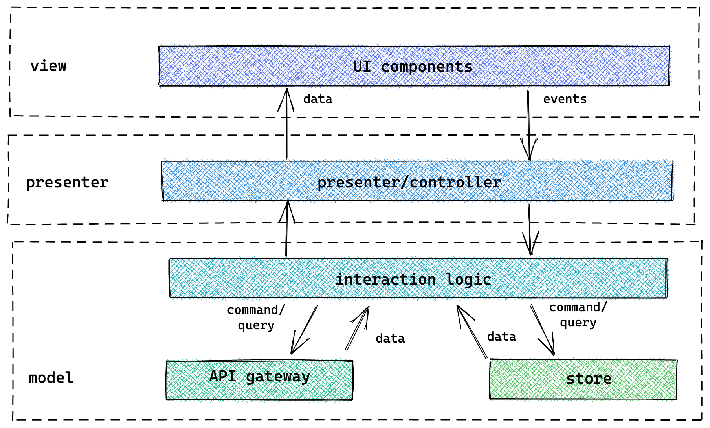
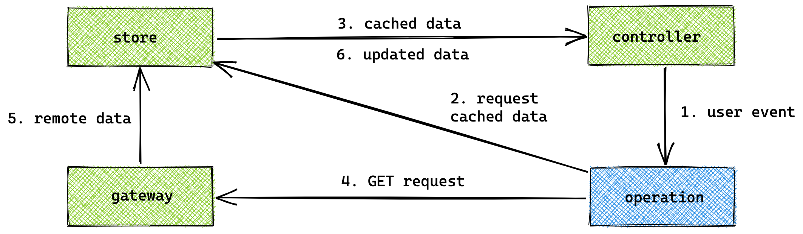

# Client-side software design

**2021 version** | **Author**: Kevin Pennekamp | front-end architect | [kevtiq.dev](https://kevtiq.dev) | <hello@kevtiq.dev>

This document describes the concepts and guidelines around client-side software design for digital enterprise applications. It shows how what is important to focus on, and how to apply structure. The goals of this document can be deduced to three goals. 

- **Enable agility**. A good architecture helps you to embrace change from different angles (technology, business, requirements, etc.). This helps you further minimize the cost of change. 
- **Minimize cost of change**. Create testable and maintainable code, and look ahead of what might come. A good architecture and a set of guidelines allows for easier technology decisions and change it along the way. 
- **Shared understanding**. Modern client-side libraries do not offer guidelines on structure and organizing code. This requires a shared language of architectural patterns.

## Context & concepts

Client-side applications are almost always part of a bigger system. The systems we create comprise many internal and external/public services. Client-side applications connect to internal services through the published APIs of the system. The [C4 model](https://c4model.com) container diagram (or level 2) is displayed below.

Due to this place in a system, the concepts of a client-side application differ from the other containers in the system. The client-side application focuses on: 

- Communicating with external APIs.
- Invoking and handling user events.
- Interact with the OS (e.g. browser, iOS).
- State management inside the application. 
- Styling and accessibility.

## Design principles

A reference architecture is an abstract blueprint for a specific class of information systems. It describes a set of guidelines on how to design an application architecture. It shows core components, the interrelationships among them, and their essential attributes. 

This reference architecture is a guideline for designing client-side application. It offers framework-agnostic principles focused on the architecture behind the user interface. It applies to single-page, server-side rendered, and component-based mobile applications (e.g. React Native). 

### Separation of concerns
The first and most important principle is *separation of concerns*. It is the activity of enforcing logical boundaries between each of the architectural concerns. It allows for *maintainable* and *testable* code. 

#### Clean architecture
A common method is the [clean architecture](https://blog.cleancoder.com/uncle-bob/2012/08/13/the-clean-architecture.html). The UI is in the original outer layer of the clean architecture. But, modern client-side frameworks make client-side applications more like traditional applications. Thus several layers can apply to client-side applications, as displayed below. 

The three depicted layers show us the first level of separation. The separation helps us to understand how users interact with our code. But it also shows how our code interacts with the browser and external APIs. 

- **Infrastructure**: all interface-related code (UI, browser APIs, and external APIs). The implementation is often abstracted into adapters (e.g. `Axios` or `React`).
- **Application**: describes all (user) interactions (e.g. clicking a submit button). Often called features, use-cases, actions, or operations. 
- **Domain**: holds all business domain-related logic required for the UI (e.g. validation). Most domain logic lives elsewhere in the system.

#### Model-View-Presenter (MVP)
This first layer of separation aids in creating a shared understanding of a client-side application. But,  it is a too high level for implementation. When dissecting a complete feature as a vertical slice, we see touching all layers of the clean architecture. Structuring this results in a decomposed version of the [Model-View-Presenter](https://en.wikipedia.org/wiki/Model–view–presenter) pattern. Note that the displayed colors match those of our clean architecture visualization.

Each feature is a vertical slice through this model. The view layer is responsible to show data and generating user events. Domain logic determines what to show, or what user event to invoke. The presenter/controller links the view layer with the model layer. It can use information from the URL in its role, like `userId` (*route state*).

> A page is a good example of a presenter/controller, as many components use the same data and operations. But, in complex settings components can have a controller integrated.

User events go through a chain of operations in the model layer. Operations translate the user event into fetch requests or state mutations. Operations represent the *application* layer from the clean architecture. The chain of operations can include general-purpose operations (e.g. logging and authorization).

The gateway and store are adapters from the *infrastructure* layer. The gateway handles fetch requests and provides on the request status (*meta state*). The store handles persist data (either persists for a session, or between sessions). It holds a cached version of server data (*remote state*) and state required in the application (*global state*). Both are responsible to update the presenter on state change. 

> **TESTABILITY**: the described separation allows for more testable code, but also understanding better what to test. The inner layers of the clean architecture are more stable and less likely to change in the long-term. These are the parts you should test. The outer layer is subjected to change and testing is less important there. However, abstracting the infrastructure in adapters allows for another testable layer. This effectively means that everything in the 'model layer' of the MVP model should be tested. 

### Command-query separation (CQS)
The operations can be further separated using [command-query separation (CQS)](https://en.wikipedia.org/wiki/Command%E2%80%93query_separation). This pattern describes how to split read and write operations. _Queries_ only return data and don't impact state. _Commands_ change the state, but do not return data.

By splitting commands and queries, a client-side application becomes _reactive_. One component can subscribe to an application store through a query. Another component updates the store through a command, invoking change in the first component.

This pattern allows for the `stale-while-revalidate` caching strategy. When executing a query, the store serves a cached version first. If the cached version is 'invalid', the operation sends a new request. Upon receiving the response, the store updates and broadcasts the changes. Commands touching records in the store, invalidate those records (e.g. [optimistic UI](https://www.smashingmagazine.com/2016/11/true-lies-of-optimistic-user-interfaces/)). 

### Co-location
Even when applying the first two principles, large client-side applications can become unmaintainable. [Co-location](https://kentcdodds.com/blog/colocation) describes that code and data should live close to where it is used. This allows for better developer experience, but above all, better maintainability of applications. The co-location principle is like the idea of [screaming architecture](https://blog.cleancoder.com/uncle-bob/2011/09/30/Screaming-Architecture.html). This describes that the general structure of your architecture should show the purpose of the application.

By grouping features into descriptive modules, you can achieve a screaming architecture. The gateway and the store of the visualized architecture are generic. Thus a  module contains UI components, UI logic, controllers, and operations. 

## Infrastructure layer patterns
The infrastructure layer in the clean architecture is the layer most subjected to change. In client-side applications it is dependent on the choice of technology. Various frameworks exist for the UI (e.g. React and Vue) and many more will come into play in coming years. On the other end, new API technologies like GraphQL are gaining in popularity. Because of this nature, adapters are used to stabilize the implementation.   

This document describes either how to implement a mature adapter, or conceptually look at elements from the infrastructure layer. 

### Gateway
The API gateway enables a consistent way to connect various external sources or APIs (e.g. REST and GraphQL). It includes a *client* (e.g. `Axios` client) that sends out the requests. Each request goes through a chain of **middleware**. A middleware is a [_decorator_](https://www.oreilly.com/library/view/learning-javascript-design/9781449334840/ch09s14.html) that enhances each request (e.g. add authentication information).

> **NOTE**: many open-source API clients implement a similar structure (e.g. [Apollo Client](https://www.apollographql.com/client/))

Each request, regardless of the related external source, first goes through a _controller_. It allows for the sharing of generic logic between different clients of different external sources. This facade handles:

- [_circuit breaking_](https://en.wikipedia.org/wiki/Circuit_breaker_design_pattern) to ensure only external APIs are called when they are available. If it receives a server error, it bounces future outgoing requests for a limited time, allowing the API to restart itself.
- Implement logic for authentication information refreshing. If a refresh request is in flight, it queues all other requests until the refresh request is finished.
- Send requests to the correct middleware and client.
- Handle the `stale-while-revalidate` pattern in cache invalidation combined with the application store or a _proxy_ cache.

### Application store
Large applications use the store for global state management, the application store. But, according to the [co-location] principle data should live close to where it is used. This means that modules can have a store of their own. The recommendation is that the store follows the patterns around [event sourcing](https://martinfowler.com/eaaDev/EventSourcing.html). This means that the store should be *centralized*, *event-driven* and *immutable*. 

To follow the principles of this architecture, it uses an **access layer**. This _element_ is an [_facade_](https://en.wikipedia.org/wiki/Facade_pattern) and decouples the state interface, allowing for better composability. The access layer handles events and applies them to the *storage*. The access layer can be connected to different data storages.

> **NOTE**: many front-end applications use global state management for all data. Many existing global state management packages like [Redux](https://redux.js.org/style-guide/style-guide) have a coupled state interface. Although events are defined elsewhere, they have to be configured in the store. Another option is using an atomic state library.

An element triggers an event and the data is changed. The access layer sends an event to an integrated event emitter or [pub/sub](https://en.wikipedia.org/wiki/Publish%E2%80%93subscribe_pattern). The emitter broadcasts the change to all UI components subscribed to these events. 

### User interface component anatomy

User interface (UI) components are the most important parts of the application. It requires the most development time. It is where the user sees and interacts with the application. There are three different component types.

- **Layout** components are used for positioning of content (e.g. a Stack component) and are without styling by default (e.g. no background color). As no business logic is present in these components, they live outside the modules.
- **Interaction** components are generic components that allow the user to interact with the application (buttons, links, form elements, etc.). Like layout components, they are without styling by default, exist outside the modules.
- **Content** components hold the user interface around the business logic. These components live within the modules and use layout components. They comprise five different elements that interact with each other.

The API is how the parent UI component interacts with this component. The parent component can provide values, configuration, and callbacks through the API. The values and configuration are combined with the component state, used to render the UI.

A user interacts with the UI. This interaction invokes an action. A component can use an action from the module or define the action itself. The action can update the component state or invoke a callback received through the API. The observer of a component listens to the values from the API and the state for changes. When a change happens, it invokes a re-render of the UI and invokes an action.

> **NOTE**: modern UI frameworks like React and Vue handle the described observer. React handles re-renders of the UI, while the life-cycles methods (e.g. `useEffect`) handle invoking actions.

### State management
In modern client-side applications, state management is one key concepts. In general, there are five different types of state present in an application.  

- **Local**: state that is used by a single UI component.
- **Shared**: state that is used by multiple UI components. It can live in a parent component, or on a global level.  
- **Meta**: also known was 'state about state'. A common example is a `loading` state around fetch requests.
- **Route**: state stored in the current URL of the application (e.g. object IDs or pagination information). 
- **Remote**: a copy of data coming from a server. 

