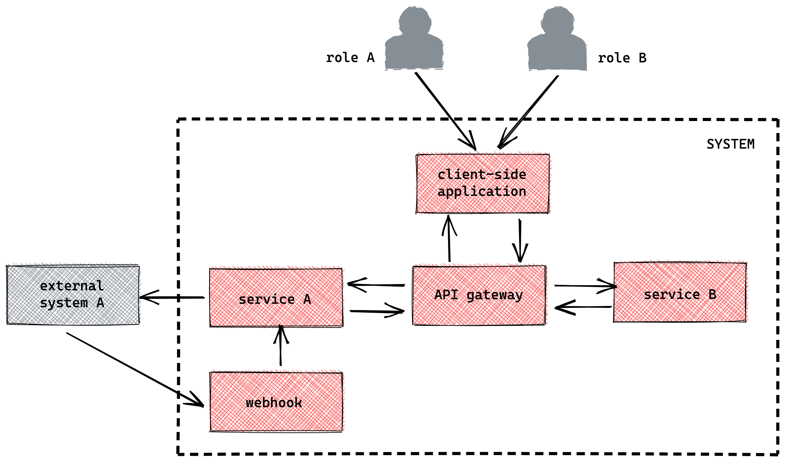
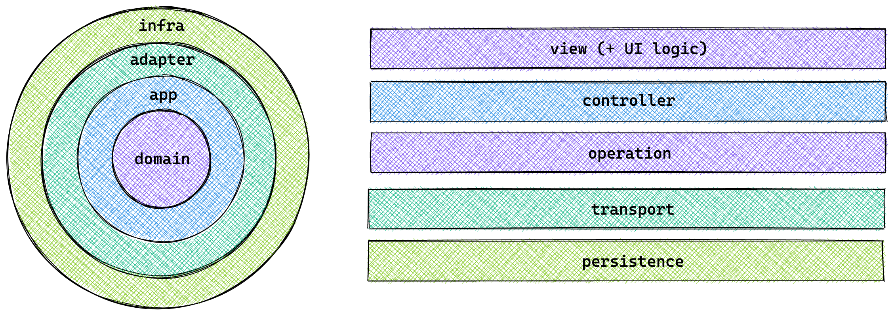
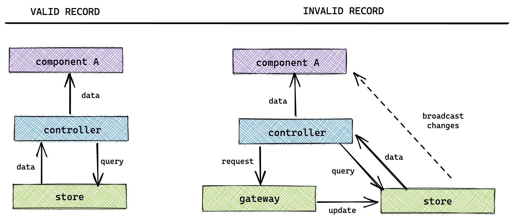
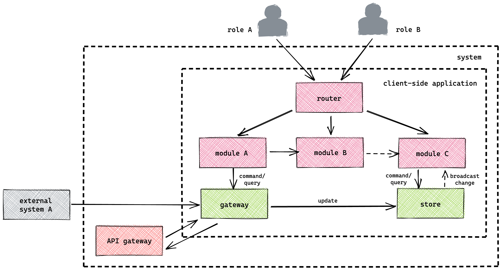
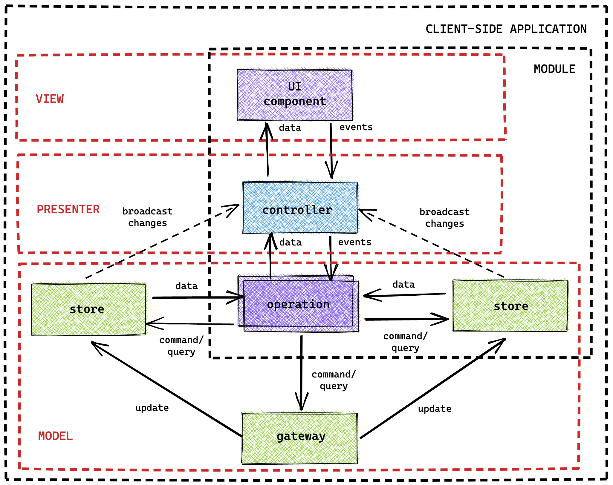
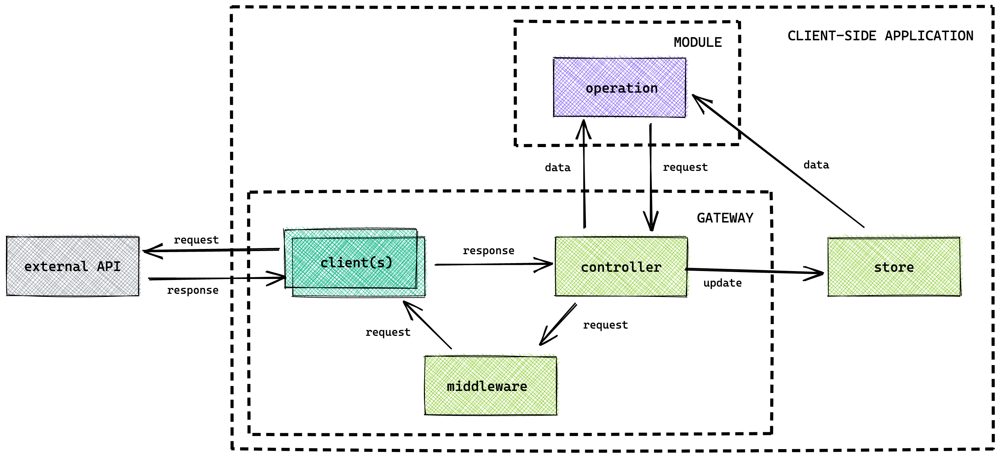
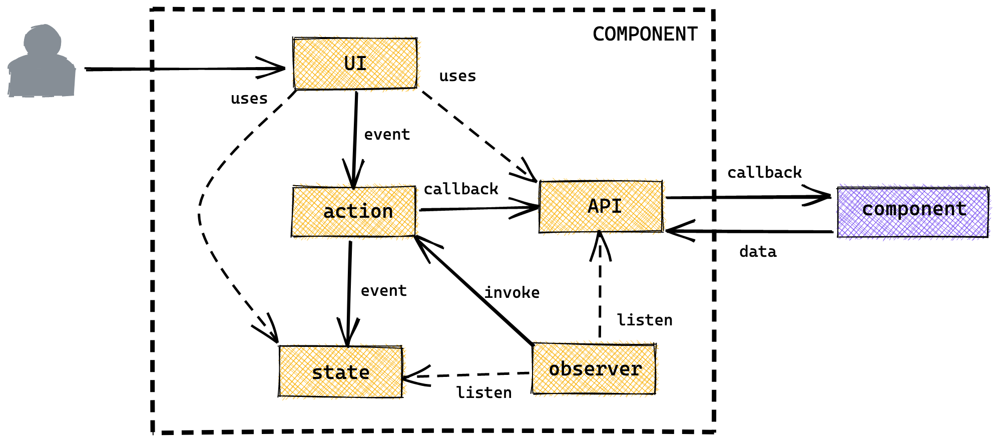

# Front-end reference architecture

**Version 3.0.0** | **Author**(s): Kevin Pennekamp | front-end architect | [vycke.dev](https://vycke.dev) | <hello@vycke.dev>

> "A good architecture enables agility" - Simon Brown, author of the C4 model

This document describes a reactive reference architecture for digital enterprise client-side applications. It offers framework-agnostic best practices focused on the architecture behind the user interface.

> **DEFINITION**: a reference architecture is an abstract blueprint of a structure for a specific class of information systems. It describes a set of guidelines on how to use the structural description in designing a concrete architecture.

## System context

Client-side applications for digital enterprises are a single part of a bigger system. The systems we create comprise many internal and external/public services. Client-side applications connect to internal services through an API gateway. Sometimes, the client-side application also connects to an external service (e.g. a public data set). The [C4 model](https://c4model.com) container diagram (or level 2) is displayed below.

Modern solutions are library-based. They do not offer guidelines in how to structure and organize code to achieve _maintainability_, _flexibility_, and _testability_. This requires a shared language of architectural patterns. This document describes common patterns from software development applied to the client-side.

## Core principles

There are four principles influencing the decisions of this reference architecture.

### Separation of concerns

Separation of concerns is the activity of enforcing logical boundaries between each of the architectural concerns. A common method is the [clean architecture](https://blog.cleancoder.com/uncle-bob/2012/08/13/the-clean-architecture.html), displayed on the left. The two centered layers are always solutions. specific, while the outer layers could be sharable between solutions.

Although clean architecture does not fit client-side applications, it gives insights into different layers that exist in client-side applications. These layers are displayed on the right. Each feature on a client-side application is a vertical slice through these layers.

### Command query separation (CQS)

On top of the separation of concerns through a layered architecture, the **[Command Query Separation (CQS)](https://en.wikipedia.org/wiki/Command%E2%80%93query_separation)** pattern is used. This pattern describes how to read and write operations, both internal and external, should be split. _Queries_ don't impact state, and return data, while _commands_ change the state, but do not return data.

By splitting commands and queries, a client-side application can be made _reactive_. One component can subscribe to an application store through a query. When another component updates the store through a command, the first component is updated.

Using CQS, cache invalidation becomes easier. When executing a query (done by operations) the cache is first checked. If the record exists and is flagged as 'valid', no request is sent out. The moment a command is executed on a record, it is set to 'invalid'. On the next query, the value from the cache is returned first, but a request is sent out. The cache gets updated with the response value, which broadcasts the changes to the UI. This allows for _reactivity_, _observability_, and the [_optimistic UI_](https://www.smashingmagazine.com/2016/11/true-lies-of-optimistic-user-interfaces/) pattern.

### Domain-driven development

Features are vertical slices in the layers defined in the "separation of concerns" section. Features are decoupled from other features. But, in large-scale client-side applications, features are often coupled based on domain. By applying [domain-driven development (DDD)](https://martinfowler.com/bliki/BoundedContext.html) we can group similar features in _modules_ like displayed in the below C4 component diagram (level 3). To ensure that users are presented with the correct modules, a _router_ is used.

> **NOTE**: modules represent the top three layers defined in the separation of concerns. The _gateway_ and _store_ represent the other two layers and are discussed in a different section. Other elements can exist on this level (e.g. pub/sub, history stack, web-workers).

By dividing features into modules, the client-side application becomes more maintainable, scalable, and shareable. Modules can be extracted from one solution and used in another (e.g. as a micro front-end or NPM package). Modules can depend on each other. There are two types of dependencies:

- _Hard dependency (solid arrow)_: when module A depends on module B, module A can invoke commands impacting module B.
- _Soft dependency (dotted arrow)_: when module A depends on module B, module A can use queries or UI components from module B.

### Co-location

[Co-location](https://kentcdodds.com/blog/colocation) describes that code and data should live close to where it is used. This allows for better developer experience, but above all, better maintainability of applications.

## Module architecture

To follow the core principles, the main idea of the module architecture follows the [Model-View-Presenter](https://en.wikipedia.org/wiki/Model%E2%80%93view%E2%80%93presenter) pattern. The general architecture is displayed below.

The _controller_ can take many forms. It can be a UI component (e.g. page) that combines state interaction and external calls with UI rendering. Or, it can be a controller with no UI that is used by many UI components to perform commands and queries. The last possibility is that the controller is integrated into a UI component.

> **NOTE**: React Context can a controller-type presenter.

Big modules consist of many pages. In that case, the module includes a module-level **router**, implemented on the highest level. This can be the controller or a wrapper. In the latter's case, it is common that each page has, or is, its controller.

In the _operations_ (a.k.a. actions) is where decision are made. They link the controller, and so the UI, to our data stores and APIs. They go beyond commands and queries, as they implement more logic as well (e.g. validation logic).

The _module store_ allows for atomic data storage, complying with the co-location principle. This allows modules to decouple from application elements and become more shareable.

## Application and module store

Large applications use the store for global state management, the application store. But, according to the [co-location] principle data should live close to where it is used. This means that modules can have a store of their own. The recommendation is that the store follows the patterns around [event sourcing](https://martinfowler.com/eaaDev/EventSourcing.html). This means that the store should be:

- It stores data in a **centralized** and normalizes the data, i.e. nesting of relational data is not allowed.
- It is the owner of the data shape and mutations to increase resilience, i.e. it is **event-driven** and **immutable**.

To follow the principles of this architecture, it uses an **access layer**. This _element_ is an [_facade_](https://en.wikipedia.org/wiki/Facade_pattern) and decouples the state interface, allowing for better composability. Store events (`get` and `update`) can be defined and invoked on a module-level. The access layer handles these events and applies them to the **storage**. The access layer can be connected to many data storage.

> **NOTE**: many front-end applications use global state management for all data. Many existing global state management packages like [Redux](https://redux.js.org/style-guide/style-guide) have a coupled state interface. Although events are defined elsewhere, they have to be configured in the store. Another option is using an atomic state library.

An element triggers an event, the data is changed. The access layer sends an `update` event via an integrated [pub/sub](https://en.wikipedia.org/wiki/Publish%E2%80%93subscribe_pattern). Other elements can subscribe to these events and activities to data changes. The access layer can subscribe to the pub/sub. This enables another way for the store to update (e.g. when requests come from a different browser tab).

## Gateway

The API gateway enables a consistent way to connect various external sources or APIs (e.g. REST and GraphQL). Each external source has its own corresponding **client** element. This element sends out the request. Each client has a chain of **middleware**. A middleware is a [_decorator_](https://www.oreilly.com/library/view/learning-javascript-design/9781449334840/ch09s14.html) that enhances each request (e.g. add authentication information).

> **NOTE**: many open-source API clients implement a similar structure (e.g. [Apollo Client](https://www.apollographql.com/client/))

Each request, regardless of the related external source, first goes through a _controller_. It allows for the sharing of generic logic between different clients of different external sources. This facade handles:

- [_circuit breaking_](https://en.wikipedia.org/wiki/Circuit_breaker_design_pattern) to ensure only external APIs are called when they are available. If it receives a server error, it bounces future outgoing requests for a limited time, allowing the API to restart itself.
- Implement logic for authentication information refreshing. If a refresh request is in flight, it queues all other requests until the refresh request is finished.
- Send requests to the correct middleware and client.
- Send update requests to a _proxy_ cache or the application store.

## User interface component anatomy

User interface (UI) components are the most important parts of the application. It requires the most development time. It is where the user sees and interacts with the application. There are three different component types.

- **Layout** components are used for positioning of content (e.g. a Stack component) and are without styling by default (e.g. no background color). As no business logic is present in these components, they live outside the modules.
- **Interaction** components are generic components that allow the user to interact with the application (buttons, links, form elements, etc.). Like layout components, they are without styling by default, exist outside the modules.
- **Content** components hold the user interface around the business logic. These components live within the modules and use layout components. They comprise five different elements that interact with each other.

The API is how the parent UI component interacts with this component. The parent component can provide values, configuration, and callbacks through the API. The values and configuration are combined with the component state, used to render the UI.

A user interacts with the UI. This interaction invokes an action. A component can use an action from the module or define the action itself. The action can update the component state or invoke a callback received through the API. The observer of a component listens to the values from the API and the state for changes. When a change happens, it invokes a re-render of the UI and invokes an action.

> **NOTE**: modern UI frameworks like React and Vue handle the described observer. React handles re-renders of the UI, while the life-cycles methods (e.g. `useEffect`) handle invoking actions.
