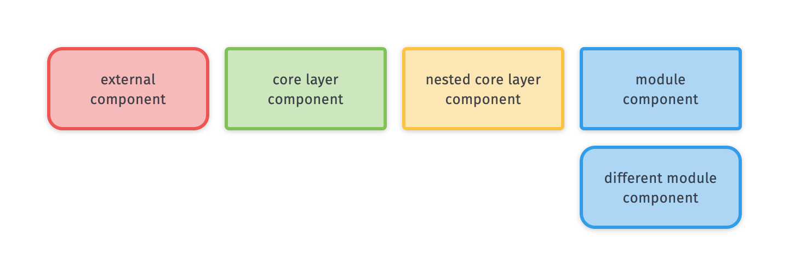
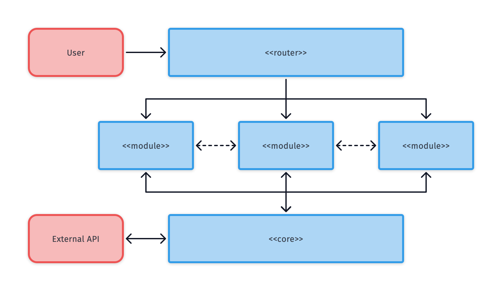
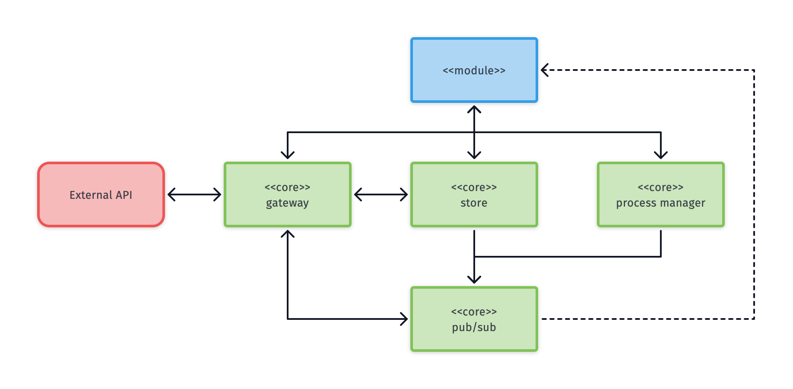
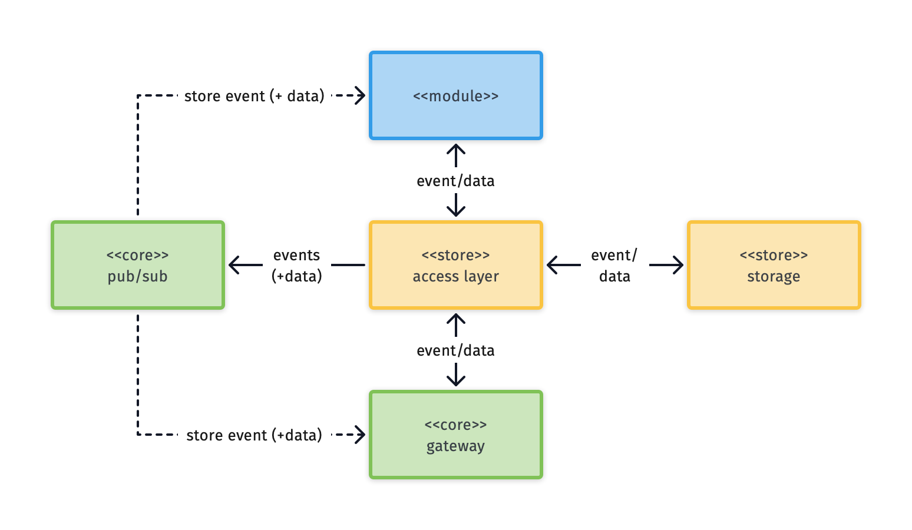
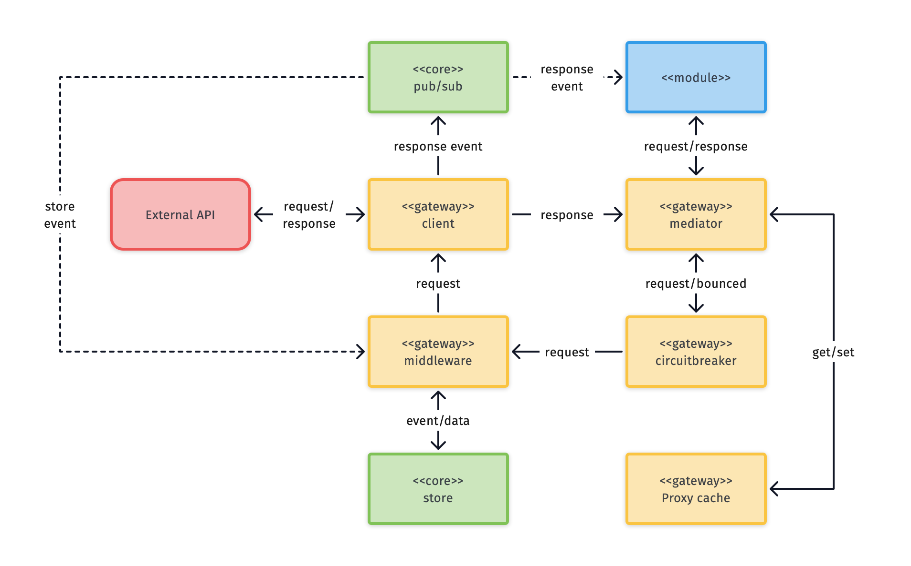
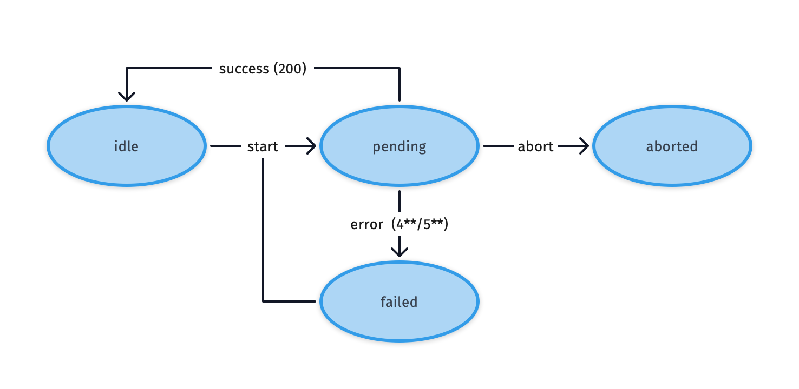
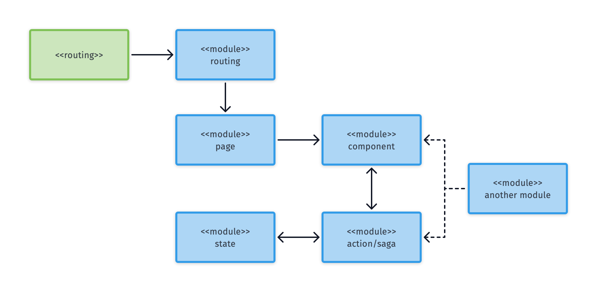
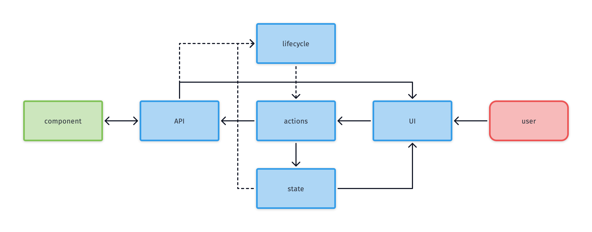

# Front-end reference architecture

##### _version 0.4.1_

**Author(s)**: Kevin Pennekamp | front-end architect | [kevtiq.dev](https://kevtiq.dev) | <hello@kevtiq.dev>

This document describes a reactive reference architecture for front-end applications to build digital enterprises. It offers framework-agnostic best practices focused on the architecture behind the user interface.
 
## Introduction

The goal of the architecture is to enable engineers to create large-scale applications. These applications have many users, external connections, and long development time. To achieve control over the business outcomes, it requires an [antifragile](https://www.sciencedirect.com/science/article/pii/S1877050916302290) architecture. There are six key principles:

- **Consistency** in user experience, but also for the engineers working on the application.
- **Resilience**, to ensure stable user experience, by applying safeguards in the application's core.
- Enable development **agility** by focusing on reusable UI components.
- A **reactive** user interface that updates based on interactions.
- Modularity in core elements and user interface allows for easy **scalability**.
- **Maintainability** through scalability, consistency and [separation of concerns](https://en.wikipedia.org/wiki/Separation_of_concerns).

The architecture goes three levels deeps. The legend below describes the meaning of the different visualizations in this document.

## High-level overview

The main idea behind the reference architecture is to implement [domain driven development](https://martinfowler.com/bliki/BoundedContext.html). A [layered architecture](https://en.wikipedia.org/wiki/Multitier_architecture) facilitates this by introducing three layers:

- The **router** is part of the presentation layer. This layer determines which modules the user can interact with.
- The **modules** layer represents the presentation layer, but also the business layer. Most of the work will be in this layer. A module, or [cell](https://github.com/wso2/reference-architecture/blob/master/reference-architecture-cell-based.md), represents a part of the business.
- The **core** layer represents the application and data access layer.

## Application core

The core layer centralizes critical *blocks*, as visualized below. This centralization contributes to the maintainability of the application. The blocks below can be present in the core layer.

- An application **store** that holds data impacting how the application behaves towards users.
- A **gateway** handling all outgoing communication towards many external sources.
- The **[pub/sub](https://en.wikipedia.org/wiki/Publish%E2%80%93subscribe_pattern)** synchronizes other elements in the core layer. The presentation layer can use to update. Besides, it allows for cross-browser tab synchronization.
- A **process manager** mediates and prioritizes heavy background operations (i.e. web-workers).

Besides these blocks, several other blocks can live in the core layer. Examples are the browser **history** stack and an **error tracker**.

### Application store

Large applications use the store for global state management. The recommendation is that the store follows the patterns around [event sourcing](https://martinfowler.com/eaaDev/EventSourcing.html). This means that the store should be:

- It stores data in a **centralized** and normalizes the data, i.e. nesting of relational data is not allowed.
- It is the owner of the data shape and mutations to increase resilience, i.e. it is **event-driven** and **immutable**.

To follow the principles of this architecture, it uses an **access layer**. This *element* decouples the state interface, allowing for higher scalability and maintainability. Store events (`get`, `set`, `update`, or `remove`) can be defined and invoked on a module-level. The access layer handles these events and applies them to the **data storage**.

> **NOTE**: many front-end applications use global state management for all data. Many existing global state management packages like [Redux](https://redux.js.org/style-guide/style-guide) have a coupled state interface. Although events are defined elsewhere, they have to be configured in the store.

Whenever an element triggers an event, the data is changed. The access layer sends an event (including the changed data) via the pub/sub (except in case of a `get` event). Other elements can subscribe to these events and act whenever the data changes. Normalized data allows for more accurate updates events to the user subscribers.

### API gateway

> **NOTE**: in case of only one external source, a single API client can replace the gateway. Many open-source API clients support a similar structure (e.g. [Apollo Client](https://www.apollographql.com/client/)).

The API gateway enables a consistent way to connect to many external sources (e.g. REST and GraphQL). A [**mediator**](https://en.wikipedia.org/wiki/Mediator_pattern) allows for sharing of generic elements with different **clients**.

Each request, regardless of the related external source, goes through the mediator. The mediator sends each request through three *elements* before it hits the API client:

- The **cache** is a proxy that stores all responses, for a certain period ('state-while-revalidate' pattern). The mediator acts as the *data access layer* of the cache, as the application store.
- A [**circuit breaker**](https://en.wikipedia.org/wiki/Circuit_breaker_design_pattern) maintains the state of the external source. If it receives a server error, it bounces outgoing requests to prevent reoccurring failure.
- A chain of **middleware** enhances each request (e.g. the refreshing of authentication information). The middleware has access to the application store and the pub/sub.

The mediator sends the request to the correct client after the middleware. With a `cache-network` strategy, a cached value is provided first. When the mediator receives the response, it sends it to the request initiator and the cache.

> **NOTE**: in case your chosen UI framework does not allow of UI updates around asynchronous calls, you can let the element subscribe to the pub/sub and have the mediator send the response via the pub/sub. you can use the pub/sub.

To ensure resilience, each request should follow the same [statechart](https://statecharts.github.io/), as shown below. When all requests, regardless of their source, follow the same pattern, the API client and/or UI can consistently handle them. Each request starts in _idle_. When a request is started, it moves into the _loading_ state. From this state, four events can happen: success, abort, error, or start. In the latter's case, the previous request is aborted, and a new request is started.

## Modules

Modules facilitate the concept of [domain driven development](https://martinfowler.com/bliki/BoundedContext.html). They implement the [flux pattern](https://facebook.github.io/flux/docs/in-depth-overview/) to arrange business-related logic, state, and UI components. It includes several *blocks*, as visualized below. Each module has **components** and **actions**. They represent the view and the logic of a (business-related) module. Both can interact with the application core. Components can read from the core, while actions can invoke events in the core and wait for a response.

A module can also have a store. It acts similar to the application store. The store in a module is often used for modeling business logic. Here, the recommendation is to shape the data like a [state-machine](https://statecharts.github.io/what-is-a-state-machine.html) or [statechart](https://statecharts.github.io/what-is-a-statechart.html).

> **NOTE**: the store can be implemented in the same way as the application store, or use features from a framework (e.g. React Context).

Components, actions, and a store are common for most modules.  But some modules need other blocks.

- A gateway or section module requires a **router**. It determines which **page** or module the user can interact with.
- A route always associates with a module or a **page**. A page is a specialized component.

### Types of modules
There are three different modules identified in this reference architecture. Nesting of modules is possible, regardless of their types.

- A **gateway** module functions as a wrapper around other modules, based on routing. It provides logic and state towards the nested modules (e.g. the main application is as a gateway module).
- Many applications have many pages related to each other. **Section** modules combine these pages and their business logic into a module (e.g. CRUD pages).
- A **block** module is not related to a specific route but can be used anywhere in the application (e.g. shopping cart).

> **NOTE**: these module types are not exclusive. a _gateway_ can also be a _section_, and a _section_ can also be a *block*.

### User interface components
User interface (UI) components are the most important parts of the application. It requires the most development time. It is where the user sees and interacts with the application. It comprises five different elements that interact with each other.

The API is how a component interacts with its parent, another UI component. The parent component can provide values, configuration, and callbacks through the API. The values and configuration are, combined with the component state, used to render the UI.

A user interacts with the UI. This interaction invokes an action. A component can use an action from the module or define the action itself. The action can update the component state or invoke a callback received through the API. The observer of a component listens to the values from the API and the state for changes. When a change happens, it invokes a re-render of the UI and invokes an action.

> **NOTE**: modern UI frameworks like React and Vue handle the described observer.

