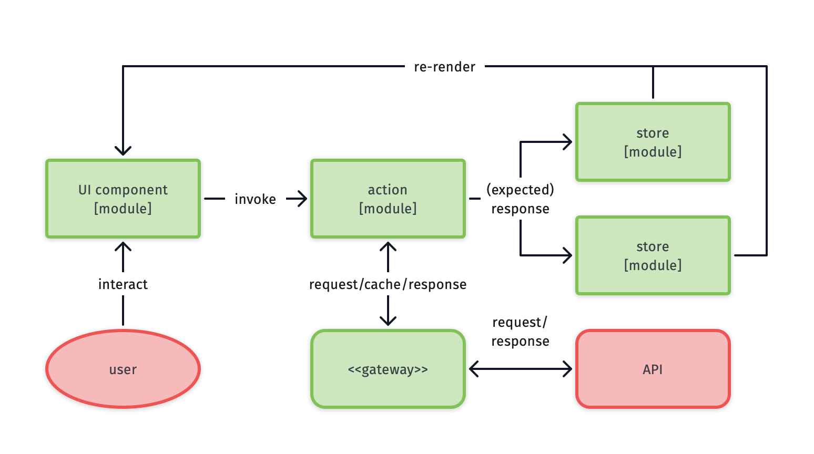
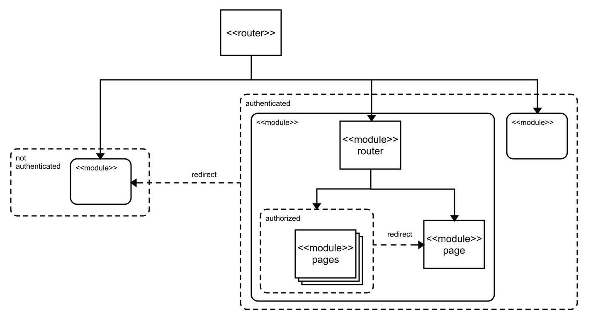

# Front-end reference architecture

##### _version 1.0.0_

**Author(s)**: Kevin Pennekamp | front-end architect | [kevtiq.dev](https://kevtiq.dev) | <hello@kevtiq.dev>

This document describes a reactive reference architecture for front-end applications (e.g. single-page applications) on a digital enterprise scale. It offers framework-agnostic best practices focused on the architecture behind the user interface.

## Introduction

The goal of the architecture is to enable engineers to create large-scale applications. These applications have many users, external connections, and long development time. To achieve control over the business outcomes, it requires an [antifragile](https://www.sciencedirect.com/science/article/pii/S1877050916302290) architecture. There are three key principles:

- **Resilience**, to ensure stable user experience that can be measured, by applying safeguards in the application's core.
- A **reactive** application that updates based on (user interaction).
- **Composability** in core elements and user interface components to enable development _agility_, resulting in a _scalable_ and _maintainable_ solution with a _consistent_ user experience.

The architecture goes three levels deeps. The legend below describes the meaning of the different visualizations in this document.

## High-level overview

The main idea behind the reference architecture is to implement [domain driven development](https://martinfowler.com/bliki/BoundedContext.html). A [layered architecture](https://en.wikipedia.org/wiki/Multitier_architecture) facilitates this by introducing three layers:

- The **router** is part of the presentation layer. This layer determines which modules the user can interact with.
- The **modules** layer represents the presentation layer, but also the business layer. Most of the work will be in this layer. A module, or [cell](https://github.com/wso2/reference-architecture/blob/master/reference-architecture-cell-based.md), represents a part of the business.
- The **core** layer represents the application and data access layer.

## Application core

The core layer centralizes critical _blocks_, as visualized below. This centralization contributes to resilience of the application. The blocks below can be present in the core layer.

- An application **store** that holds data impacting how the application behaves towards users.i
- A **gateway** handling all outgoing communication towards many external sources.
- The **[pub/sub](https://en.wikipedia.org/wiki/Publish%E2%80%93subscribe_pattern)** synchronizes other elements in the core layer. The presentation layer can use to update. Besides, it allows for cross-browser tab synchronization.
- A **process manager** mediates and prioritizes heavy background operations (i.e. web-workers) to increase the performance of the web application.

Besides these blocks, several other blocks can live in the core layer. Examples are the browser **history** stack and an **error tracker**.

### Application store

Large applications use the store for global state management. The recommendation is that the store follows the patterns around [event sourcing](https://martinfowler.com/eaaDev/EventSourcing.html). This means that the store should be:

- It stores data in a **centralized** and normalizes the data, i.e. nesting of relational data is not allowed.
- It is the owner of the data shape and mutations to increase resilience, i.e. it is **event-driven** and **immutable**.

To follow the principles of this architecture, it uses an **access layer**. This _element_ decouples the state interface, allowing for better composability. Store events (`get`, `set`, `update`, or `remove`) can be defined and invoked on a module-level. The access layer handles these events and applies them to the **data storage**.

> **NOTE**: many front-end applications use global state management for all data. Many existing global state management packages like [Redux](https://redux.js.org/style-guide/style-guide) have a coupled state interface. Although events are defined elsewhere, they have to be configured in the store.

Whenever an element triggers an event, the data is changed. The access layer sends an event (including the changed data) via the pub/sub (except in case of a `get` event). Other elements can subscribe to these events and act whenever the data changes. Normalized data allows for more accurate updates events to the user subscribers.

### API gateway

> **NOTE**: in case of only one external source, a single API client can replace the gateway. Many open-source API clients support a similar structure (e.g. [Apollo Client](https://www.apollographql.com/client/)).

The API gateway enables a consistent way to connect various external sources (e.g. REST and GraphQL). A [**mediator**](https://en.wikipedia.org/wiki/Mediator_pattern) allows for sharing of generic elements with different **clients**.

Each request, regardless of the related external source, goes through the mediator. The mediator sends each request through three _elements_ before it hits the API client:

- The **cache** is a proxy that stores all responses, for a certain period ('state-while-revalidate' pattern). The mediator acts as the _data access layer_ of the cache, as the application store.
- A [**circuit breaker**](https://en.wikipedia.org/wiki/Circuit_breaker_design_pattern) maintains the state of the external source. If it receives a server error, it bounces outgoing requests to prevent reoccurring failure. It can be seen as a first link in the chain of middleware.
- A chain of **middleware** enhances each request (e.g. the refreshing of authentication information). The middleware has access to the application store and the pub/sub.

The mediator sends the request to the correct client after the middleware. With a `cache-network` strategy, a cached value is provided first. When the mediator receives the response, it sends it to the request initiator and the cache.

> **NOTE**: in case your chosen UI framework does not allow of UI updates around asynchronous calls, you can let the element subscribe to the pub/sub and have the mediator send the response via the pub/sub. you can use the pub/sub.

To ensure resilience, each request should follow the same [statechart](https://statecharts.github.io/), as shown below. When all requests, regardless of their source, follow the same pattern, the API client and/or UI can consistently handle them. Each request starts in _idle_. A request can either start or be scheduled. Both from _idle_ and _scheduled_ the request can start. It now moves into the _loading_ state. From this state, four events can happen: success, abort, error, or start. In the latter's case, the previous request is aborted, and a new request is started.

## Modules

Modules facilitate the concept of [domain driven development](https://martinfowler.com/bliki/BoundedContext.html). They implement the [flux pattern](https://facebook.github.io/flux/docs/in-depth-overview/) to arrange business-related logic, state, and UI components. It includes several _blocks_, as visualized below. Each module has **components** and **actions**. They represent the view and the logic of a (business-related) module. Both can interact with the application core. Components can read from the core, while actions can invoke events in the core and wait for a response.

A module can also have a store. It acts similar to the application store. The store in a module is often used for modeling business logic. It is recommended to follow the described [UI performance principles](#ui-performance-principles).

> **NOTE**: the store can be implemented in the same way as the application store, or use features from a framework (e.g. React Context).

Components, actions, and a store are common for most modules. But some modules need other blocks.

- A gateway or section module requires a **router**. It determines which **page** or module the user can interact with.
- A route always associates with a module or a **page**. A page is a specialized component.

### Types of modules

There are three different modules identified in this reference architecture. Nesting of modules is possible, regardless of their types.

- A **gateway** module functions as a wrapper around other modules, based on routing. It provides logic and state towards the nested modules (e.g. the main application is as a gateway module).
- Many applications have many pages related to each other. **Section** modules combine these pages and their business logic into a module (e.g. CRUD pages).
- A **block** module is not related to a specific route but can be used anywhere in the application (e.g. shopping cart).

> **NOTE**: these module types are not exclusive. a _gateway_ can also be a _section_, and a _section_ can also be a _block_.

### User interface components

User interface (UI) components are the most important parts of the application. It requires the most development time. It is where the user sees and interacts with the application. There are three different different types of components.

- **Layout** components are used for positioning of content (e.g. a Stack component) and are generally stylingless by default (e.g. no background color). As no business logic is present in these components, they live outside of the modules (e.g. inside a design system).
- **Interaction** components are generic components that allow the user to interact with the application (buttons, links, form elements, etc.). Similar to layout components they are stylingless by default, exist outside of the modules (e.g. inside a design system).
- **Content** components hold the user interface around business logic. These components live within the modules and use layout components internally. The consist of five different elements that interact with each other.

The API is how a component interacts with its parent, another UI component. The parent component can provide values, configuration, and callbacks through the API. The values and configuration are, combined with the component state, used to render the UI.

A user interacts with the UI. This interaction invokes an action. A component can use an action from the module or define the action itself. The action can update the component state or invoke a callback received through the API. The observer of a component listens to the values from the API and the state for changes. When a change happens, it invokes a re-render of the UI and invokes an action.

> **NOTE**: modern UI frameworks like React and Vue handle the described observer internally. React handles re-renders of the UI, while the lifecycles methods (e.g. `useEffect`) handle invoking actions.

## UI performance principles

Users expect modern web applications to be performant. Several principles are facilitated by the reference architecture to increase the _perceived_ performance. These principles describe the _where_, _when_ and _how_ of UI state management.

- **[Colocation](https://kentcdodds.com/blog/state-colocation-will-make-your-react-app-faster/) (where)**: UI state should live next to the UI code where possible (component, module or application level). State updates will result in less re-renders (of parts) of the UI.
- **[Data flow](https://overreacted.io/writing-resilient-components/#principle-1-dont-stop-the-data-flow) (where)**: state that lives on a higher level should not be put in the state on a lower level. This breaks the data flow of the observer in the [component architecture](#user-interface-components).
- **[Optimistic UI](https://www.smashingmagazine.com/2016/11/true-lies-of-optimistic-user-interfaces/) (when)**: the expected result of asynchronous or heavy tasks are stored in the state, before the actual task is finished and its result is received. This is detailed in the diagram below.
- **Transactions (how)**: when many state mutations are required, they should be combined in a single transaction (e.g. in the [application store](#application-store)).
- **[Statecharts](https://statecharts.github.io/) (how)**: UI state should be modeled as a statechart as much as possible, to improve the resilience of the UI.

Next to these principles, **prefetching** of data (where possible) results in better performance. When using _gateway_ or _section_ modules, different pages need different data. When entering a page (e.g. detail page), data for other pages can already be prefetched and put in the application/module store (e.g. for an overview page). Depending on the entry page and what exists in the store(s), different data is prefetched.

## Application governance
Governance in applications is vital for digital enterprises. It refers to the ongoing process of managing, monitoring, and auditing the use of the application. Several forms of governance are supported in this reference architecture. First of all it allows for 

Role-based access management (RBAC) is the most straight forward auditing implementation for digital enterprises. This reference architecture facilitates several possibilities in the UI that can be applied.  

- As the _router_ is the main entry-point of the application, the initial RBAC implementation needs to happen on this level.
- Each _module router_ can apply the same level of RBAC implementation. This allows for complex, nested access rules based on the URL of the application.
- RBAC can be applied inside a component (e.g. `return null` in case the user is not allowed to view the component) or in parent components by applying _conditional visibility_.
- It is possible to Actions in _modules_ and _components_ can be guarded based on 
- RBAC can be added to the _middleware_ of the _API gateway_. 

As JavaScript is an unsafe language by default (any user can alter it in the browser). So blocking rendering of the UI is not enough. When applied properly, _actions_ in modules and components can also be guarded based on the RBAC rules. Lastly, RBAC can be applied in the _middleware_ of the _API gateway_, to disallow connectivity to external sources completely. 

But governance is not all about auditing and security. Monitoring is equally important. Monitoring ensures more information, i.e. context, is stored and maintained on defects.  The _event-driven_ nature of this reference architecture makes it possible to create this context. When implementing a system tracker, logging all pub/sub, API, navigation and store events creates this context.